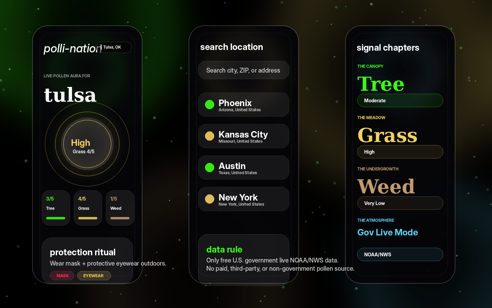
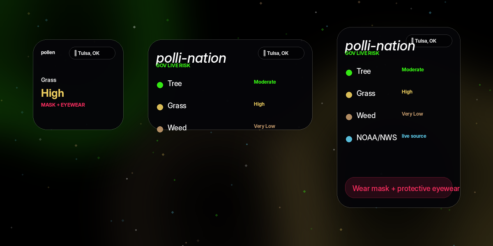

# Polli-Nation iOS — Government-Only Live Mode

Native SwiftUI pollen-risk app with WidgetKit support, current-location lookup, city/address/ZIP search, mask/eyewear warnings, and a neon zen aurora/glass visual system inspired by the original 6pollen6 UI.


## Previews





## Data rule

This build uses **only free U.S. government live data**.

`iOS App / Widget → optional Polli-Nation VPS backend → NOAA/NWS api.weather.gov → pollen-risk estimate`

No paid pollen API, non-government fallback, or third-party pollen source is included.

Accuracy boundary: NOAA/NWS provides live forecasts, alerts, observations, and raw grid forecast data by coordinate. It does not provide a measured pollen-count field. Polli-Nation therefore estimates Tree / Grass / Weed pollen risk from live NOAA/NWS weather signals plus U.S. seasonal pollen timing. The UI labels this as a pollen-risk estimate, not a lab pollen count.

## Included

- iOS SwiftUI app target: `PolliNation`
- WidgetKit extension target: `PolliNationWidget` with a top-corner location pill
- Government-only provider path in app and backend
- CoreLocation current-location support
- MapKit search for city, ZIP, address, and place lookup across the U.S.
- Tree / Grass / Weed risk cards with original-style neon pollen colors: green canopy, yellow meadow, brown undergrowth, blue atmosphere
- Regional plant rows such as oak, cedar, ragweed, Bermuda grass, and ryegrass
- Mask + protective eyewear notifications when pollen risk reaches Moderate or higher
- Background refresh for the saved location when iOS allows it
- App Group storage so the widget can display the last saved report
- FastAPI + Docker VPS backend in `backend/`

## Backend endpoints

- `GET /health`
- `GET /api/sources`
- `GET /api/pollen?lat=39.8283&lon=-98.5795&name=Current%20Location&subtitle=United%20States`

## Run in Xcode

1. Open `PolliNation.xcodeproj` in Xcode 15 or newer.
2. Select the `PolliNation` target and set your Apple Developer Team.
3. Select the `PolliNationWidget` target and set the same Team.
4. Enable this App Group for both targets: `group.com.pollination.shared`.
5. Optional VPS mode: set `POLLEN_BACKEND_BASE_URL = https://YOUR_DOMAIN` after placing the backend behind HTTPS.
6. No-backend dev mode: leave backend blank; the app calls NOAA/NWS directly for U.S. locations.
7. Build and run. Tap `Use GPS` or `Search`, then enable warnings.
8. Add the `Polli-Nation` widget from the iOS widget gallery.

## Deploy backend

```bash
cd PolliNation_iOS
cp .env.example .env
nano .env
SERVER_HOST=srv1663121.hstgr.cloud SERVER_USER=root COMPOSE_FILE=docker-compose.simple.yml ./deploy/hostinger-deploy.sh
```

Then set the HTTPS backend in Xcode:

```bash
POLLEN_BACKEND_BASE_URL = https://YOUR_DOMAIN
```

## Key files

- `PolliNation/Core/PollenService.swift` — backend + direct NOAA/NWS government-only provider logic
- `PolliNation/Core/GeocodingService.swift` — MapKit location search
- `PolliNation/Core/LocationManager.swift` — GPS permission and reverse geocoding
- `PolliNation/Core/AlertNotificationManager.swift` — warning notifications
- `PolliNation/Core/BackgroundRefreshManager.swift` — background refresh
- `PolliNation/Views/ContentView.swift` — main app UI
- `PolliNation/Views/DesignSystem.swift` — zen aurora/glass system
- `PolliNationWidget/PolliNationWidget.swift` — widget timeline and views
- `backend/app/main.py` — government-only VPS API service

## Security posture

Security hardening is included for the gov-only build:

- No API keys are required or stored.
- `.env`, Xcode local secrets, signing assets, and user-specific Xcode files are ignored.
- The backend validates NOAA/NWS forecast URLs before fetching grid data.
- Backend CORS is disabled by default and only enables origins explicitly configured in `.env`.
- Backend rate limiting is enabled through `RATE_LIMIT_REQUESTS` and `RATE_LIMIT_WINDOW_SECONDS`.
- Docker runs as a non-root user with read-only filesystem, dropped capabilities, and no-new-privileges.
- The app requests only When-In-Use location permission and shares only the saved pollen report with the widget through the App Group.

See `SECURITY_AUDIT.md` for the completed security and pentest checklist.
